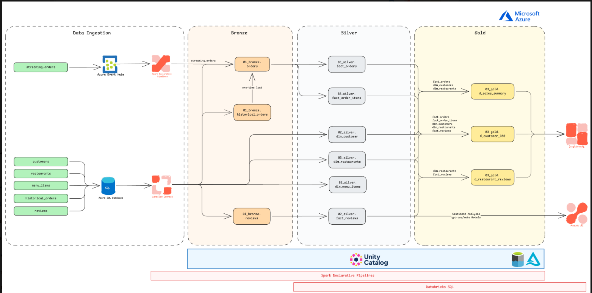
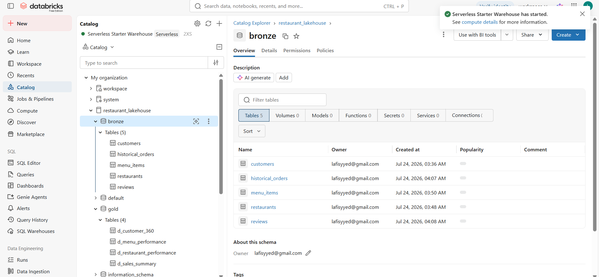
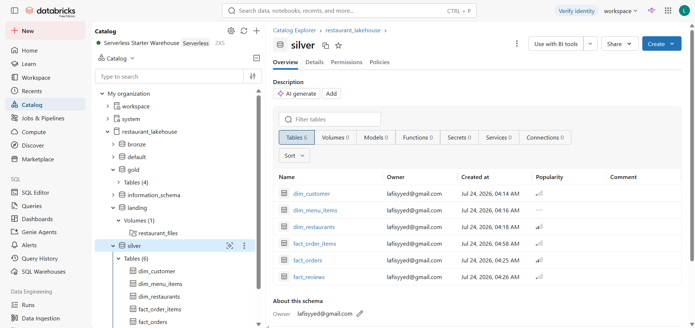
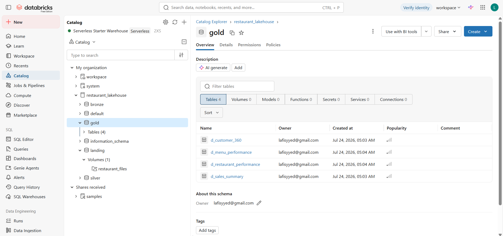
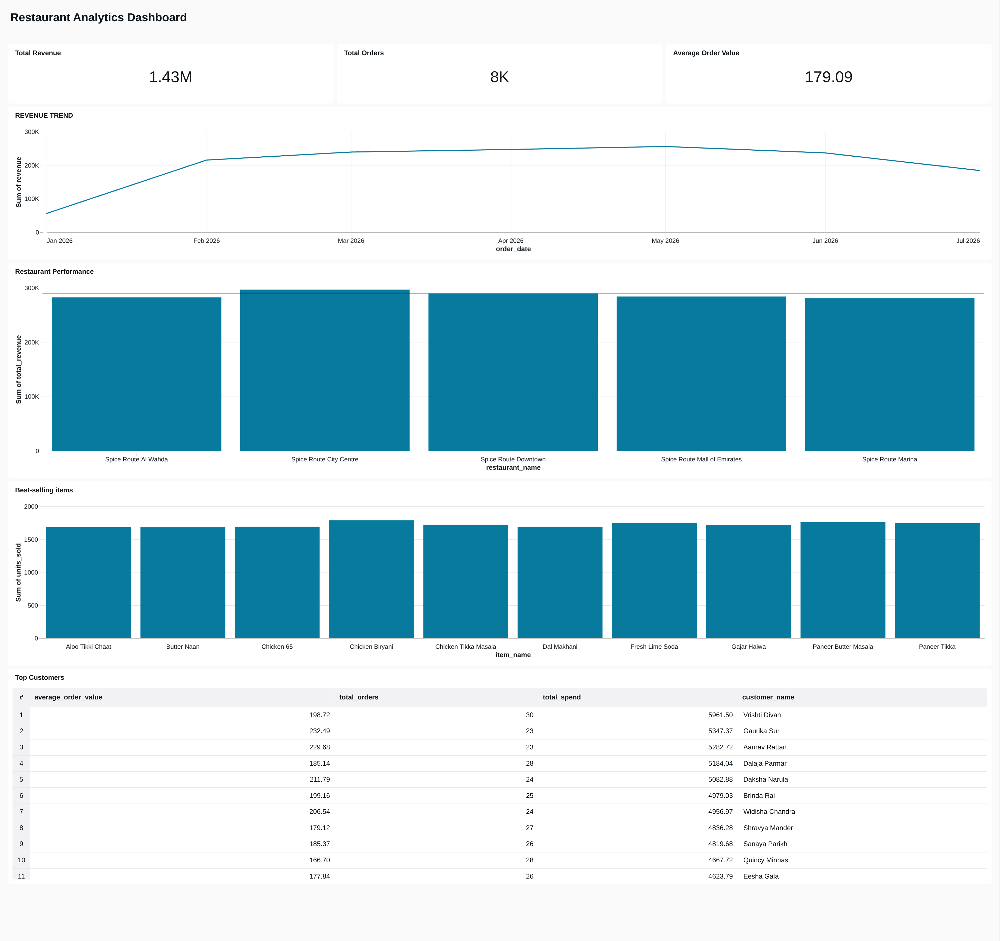
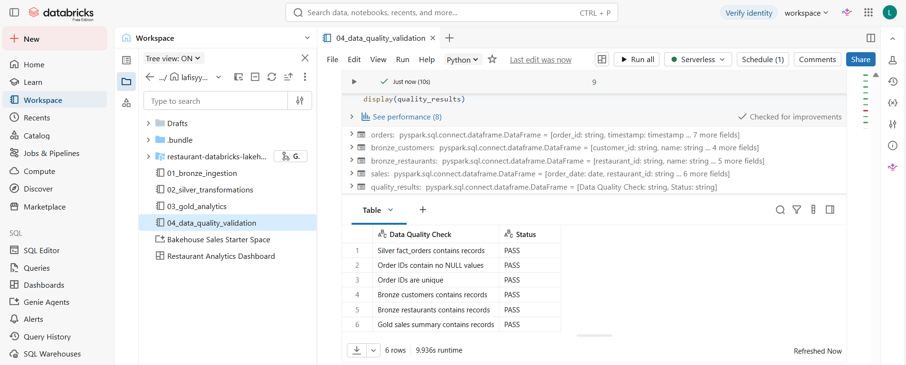
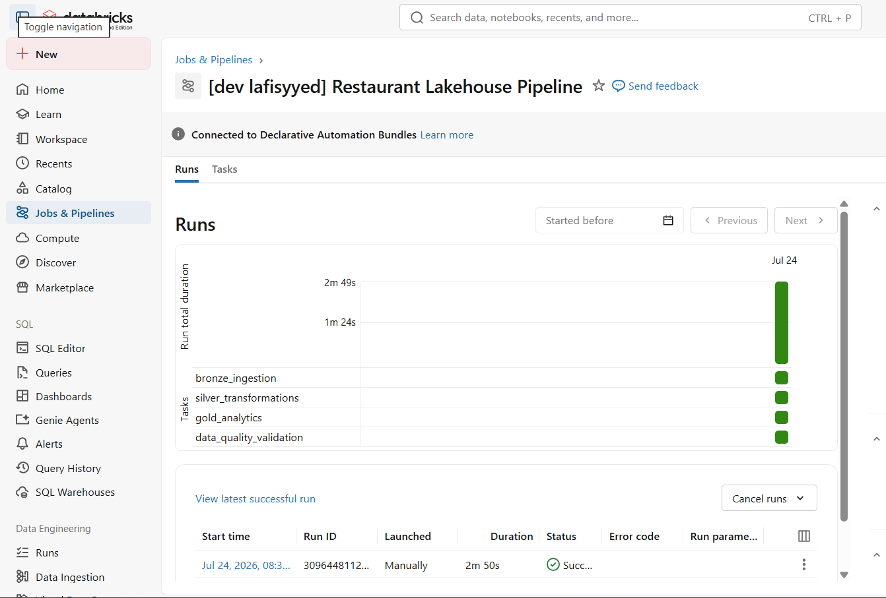

# Restaurant Analytics Lakehouse on Databricks

An end-to-end data engineering and analytics project built on Databricks using a Medallion Architecture.

The project ingests restaurant operational data, processes it through Bronze, Silver, and Gold Delta layers, performs data quality validation, orchestrates the complete pipeline using Databricks Jobs, and exposes business insights through an analytics dashboard.

## Architecture



The pipeline follows a Medallion Architecture:

Raw CSV Data  
→ Unity Catalog Volume  
→ Bronze Delta Tables  
→ Silver Transformations  
→ Gold Analytics Tables  
→ Databricks SQL Dashboard

Pipeline orchestration:

Bronze Ingestion  
→ Silver Transformations  
→ Gold Analytics  
→ Data Quality Validation

## Tech Stack

- Databricks
- Apache Spark
- PySpark
- Spark SQL
- Delta Lake
- Unity Catalog
- Databricks Jobs / Lakeflow Jobs
- Databricks SQL
- Declarative Automation Bundles
- Python
- Git
- GitHub

## Dataset

The project models a restaurant ordering platform using five primary datasets:

| Dataset | Description |
|---|---|
| Customers | Customer profiles and registration information |
| Restaurants | Restaurant locations and metadata |
| Menu Items | Restaurant menu, pricing, and categories |
| Historical Orders | Transaction-level restaurant orders |
| Customer Reviews | Ratings and textual customer feedback |

The source data is stored in a Unity Catalog Volume before ingestion into the Medallion Architecture.

## Bronze Layer

The Bronze layer performs raw ingestion from the Unity Catalog Volume into Delta tables.



Main tables include:

- `customers`
- `restaurants`
- `menu_items`
- `historical_orders`
- `reviews`

The ingestion pipeline handles CSV parsing, schema inference, nested order-item data, and Delta table creation.

## Silver Layer

The Silver layer cleans, standardizes, and transforms the raw Bronze data into analytics-ready datasets.



Transformations include:

- Data type standardization
- Null and malformed-value handling
- Order amount cleaning
- Nested JSON parsing
- Order-item explosion
- Customer dimension creation
- Restaurant dimension creation
- Fact order modeling

The nested `items` field from historical orders is parsed into structured order-item records using Spark.

## Gold Layer

The Gold layer provides business-level aggregations optimized for analytics and reporting.



Analytics include:

- Daily revenue
- Order volume
- Average order value
- Restaurant performance
- Customer activity
- Menu-item performance
- Revenue trends

These tables provide the serving layer for the Databricks SQL dashboard.

## Analytics Dashboard



The dashboard provides visibility into restaurant business performance through metrics such as:

- Total revenue
- Total orders
- Average order value
- Revenue trends
- Restaurant performance
- Customer activity

## Data Quality

The final pipeline stage validates the transformed datasets before analytics consumption.



Checks include record availability, null validation, key-field validation, and consistency checks across the Medallion layers.

## Pipeline Orchestration

The complete pipeline is orchestrated as a Databricks Job.



Execution order:

```text
Bronze Ingestion
       ↓
Silver Transformations
       ↓
Gold Analytics
       ↓
Data Quality Validation

